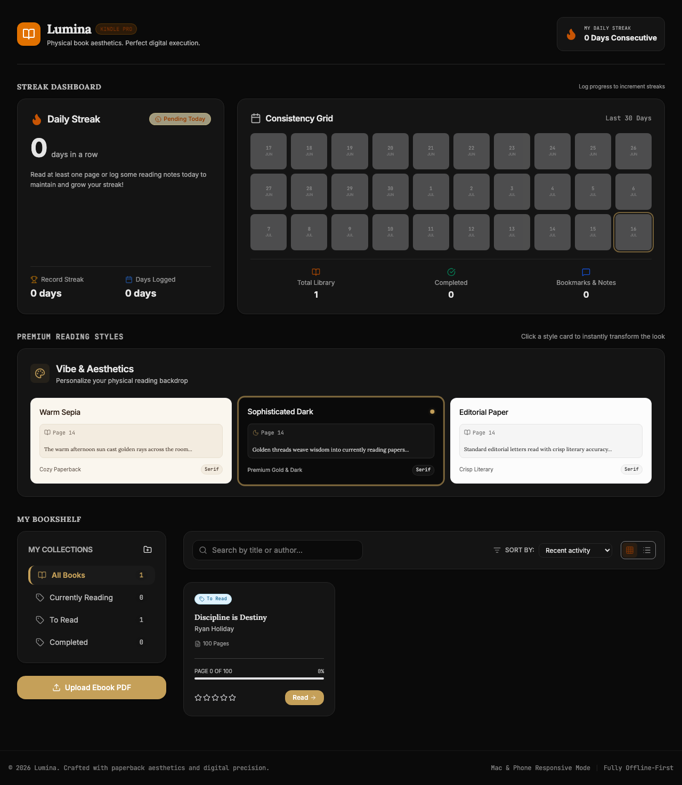
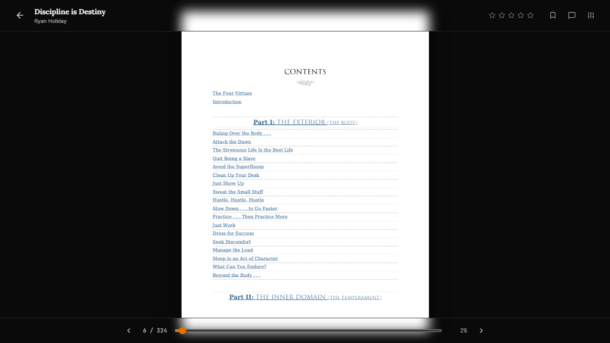
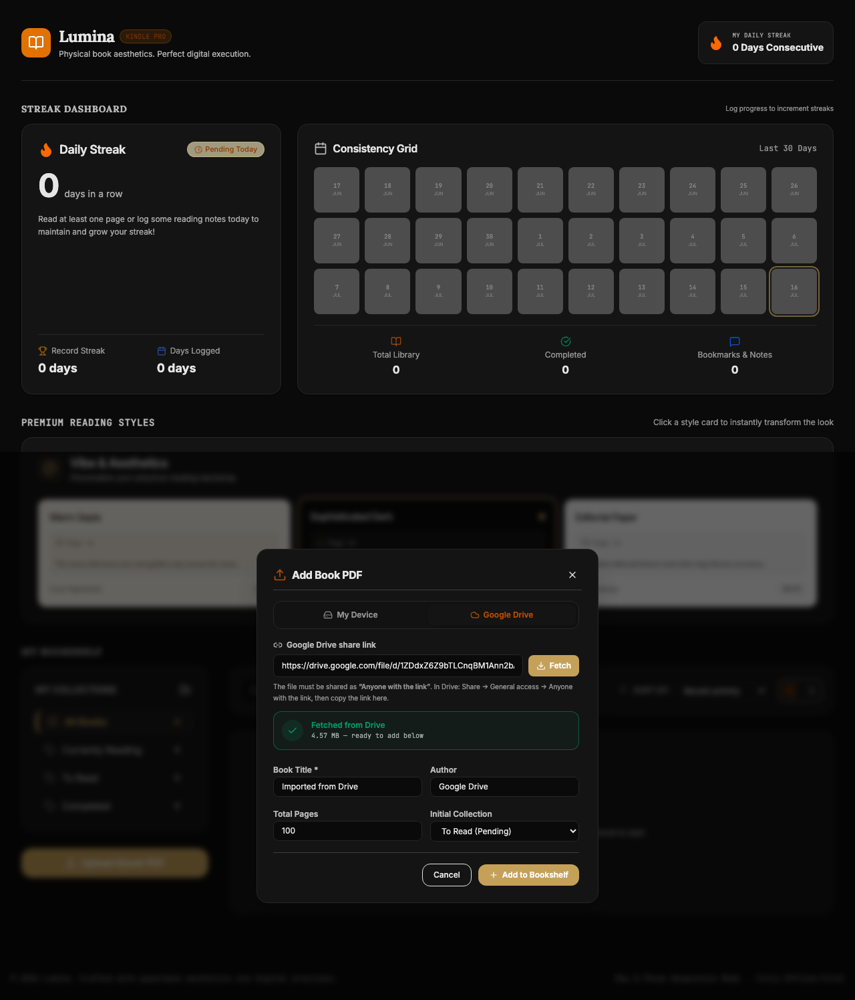

# Lumina — Kindle-style PDF Reader & Reading Tracker

A premium, offline-first reading app for desktop and mobile. Import your own PDFs (from your device or Google Drive), read them in a distraction-free Kindle-style reader, organize books into collections, track daily reading streaks, and take notes — all in eye-safe custom themes. Everything lives locally in your browser (IndexedDB): no account, no cloud lock-in.



## Features

- **A real reading experience** — a custom, paginated PDF reader (rendered with pdf.js) that turns one page at a time with tap zones, arrow keys, or a scrub slider. Minimal chrome auto-hides so it's just you and the page.
- **Auto-resume** — your place is saved automatically on every page turn and when you exit. Reopen a book and it picks up exactly where you left off; the shelf card shows your progress.
- **Import from anywhere** — add any PDF from your device (drag & drop or file picker), or paste a public **Google Drive** share link.
- **Collections** — three built-in lists (Currently Reading, To Read, Completed) plus your own custom collections with colored badges.
- **Reading streaks** — a habit tracker that logs consecutive reading days and your longest streak.
- **Notes, bookmarks & ratings** — mark pages, jot notes tied to a page, and rate your books.
- **Themes** — three hand-tuned reading styles: Warm Sepia, Sophisticated Dark, and Editorial Paper.
- **Offline-first & responsive** — books and progress persist locally in IndexedDB and the app works with no network, on Mac and phone.
- **Cross-device sync (optional)** — sign in with Google or an email magic link to sync your library, progress, notes, and the PDF files themselves across devices via Supabase. Not configured? The app just runs local-only.

## Screenshots

| Distraction-free reader | Reader controls |
|---|---|
|  |  |

Import straight from a Google Drive share link:



## Tech stack

- **React 19** + **TypeScript** + **Vite 6**
- **Tailwind CSS 4** for styling
- **pdf.js** (`pdfjs-dist`) for page rendering
- **Supabase** (Auth + Postgres + Storage) for optional cross-device sync
- **lucide-react** icons, **motion** for animation
- **IndexedDB** for local persistence and offline caching (books, PDFs, lists, streaks, settings)

## Run locally

**Prerequisites:** Node.js 18+

```bash
npm install
npm run dev
```

The app runs at `http://localhost:3000` (Vite picks the next free port if it's taken).

### Scripts

| Command | Description |
|---|---|
| `npm run dev` | Start the dev server (includes the Drive-import proxy) |
| `npm run build` | Production build to `dist/` |
| `npm run preview` | Preview the production build |
| `npm run lint` | Type-check with `tsc --noEmit` |

## Importing from Google Drive

The upload modal has a **Google Drive** tab: paste a share link for a PDF set to **"Anyone with the link"** and it imports into your library.

Because Google's download endpoint doesn't send CORS headers, the browser can't fetch it directly. Instead the app calls a same-origin proxy that fetches the file server-side (no CORS) and streams it back:

- **Production (Vercel):** [`api/drive.js`](api/drive.js) runs as a serverless function at `/api/drive`.
- **Dev/preview:** the same logic is mounted as Vite middleware (see [`vite.config.ts`](vite.config.ts) + [`lib/drive-proxy.js`](lib/drive-proxy.js)), so `npm run dev` and `npm run preview` work identically.

Private files return a clear error. Very large files stream through, but be mindful of your host's serverless execution/time limits.

## Cross-device sync (optional)

Lumina is local-first: with no configuration it stores everything in your browser. To
sync across devices, connect a free **Supabase** project — you get Google + email
sign-in, and your books, collections, streaks, notes, reading position, and the PDF
files all follow you.

The data layer is local-first with cloud mirroring: every change writes to IndexedDB
instantly (works offline) and, when signed in, also to Supabase. See
[`src/lib/store.ts`](src/lib/store.ts). PDFs are lazy-loaded — downloaded from Storage
and cached locally the first time you open a book on a new device.

**Setup:** follow [`docs/SUPABASE_SETUP.md`](docs/SUPABASE_SETUP.md) (run
[`docs/supabase-schema.sql`](docs/supabase-schema.sql), enable sign-in, then set
`VITE_SUPABASE_URL` and `VITE_SUPABASE_ANON_KEY`). Both keys are safe to expose in the
client; row-level security keeps each user's data private.

## Deploying to Vercel

Zero config — Vercel auto-detects the Vite app and the `api/` function:

- **Framework Preset:** Vite
- **Build Command:** `npm run build` (default)
- **Output Directory:** `dist` (default)
- **Install Command:** `npm install` (default)

`api/drive.js` deploys automatically as a Node serverless function. No env vars are required for the core app; to enable cross-device sync, add `VITE_SUPABASE_URL` and `VITE_SUPABASE_ANON_KEY` (see above) under **Settings → Environment Variables**.

## Project structure

```
api/
  drive.js                Vercel serverless function: /api/drive proxy
lib/
  drive-proxy.js          Shared Drive fetch/stream core (prod + dev)
docs/
  screenshots/            Images used in this README
  supabase-schema.sql     Cloud sync schema (run in Supabase)
  SUPABASE_SETUP.md       Cross-device sync setup guide
src/
  App.tsx                 App shell, state, local+cloud orchestration
  components/
    BookShelf.tsx         Library grid/list, upload modal, collections
    BookReader.tsx        Custom pdf.js reader (pagination, auto-resume)
    StreakTracker.tsx     Reading-streak dashboard
    StyleSelector.tsx     Theme picker
    AuthModal.tsx         Google + magic-link sign-in
  lib/
    db.ts                 IndexedDB read/write layer (local cache)
    supabase.ts           Supabase client + auth helpers
    cloud.ts              Cloud CRUD + PDF storage
    store.ts              Local + cloud sync orchestration
    themes.ts             Theme definitions
  types.ts                Shared types
```

## License

MIT
